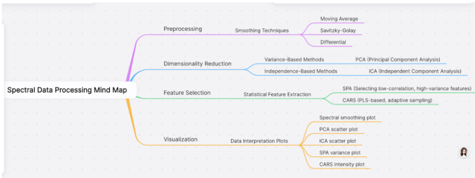
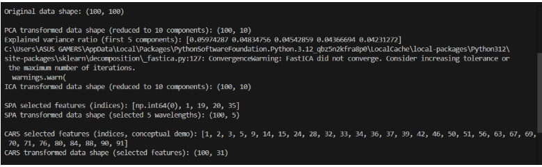

## AI's Overarching Role and Diverse Data Resources in In-Ovo Sexing

### AI’s Role

In-ovo sexing of chicken eggs can be conceptualized as a binary classification task, in which the system must accurately distinguish between male and female embryos at the earliest possible stage of incubation.  
Artificial Intelligence (AI) methods, which include both traditional machine learning algorithms and advanced deep learning architectures, play a vital role in this process by facilitating data acquisition, preprocessing, feature extraction, and predictive modeling.

The overarching aim of these approaches is to identify and analyze discriminative biological and spectral features that reliably separate male from female developmental patterns, thereby enabling early and accurate sex prediction.

Currently, these models are increasingly dependent on large-scale datasets, since the availability of big data not only enhances model training and generalization but also gives essential support for the integration of multimodal inputs such as imaging, spectroscopy, and genetic information.

---

### Data Resources

**Spectral Data:**

- **Fourier Transform Infrared Spectroscopy (FT-IR):** Uses infrared transmission and absorption spectra to gather molecular information, often from blastoderm cells, to assess DNA content differences.
- **Raman Spectroscopy:** Generates "molecular fingerprints," identifying differences in nucleated blood cells, typically using Near-Infrared (NIR) excitation wavelengths.
- **Hyperspectral Imaging:** Sensing systems that plot many closely spaced wavelengths across near-ultraviolet (300–380 nm), visible (380–780 nm), and near-infrared (780–1500 nm) regions, generating extensive spectral data.
- **Visible/Near-Infrared (VIS/NIR) Spectroscopy:** Used to analyze spectra in the visible and near-infrared ranges, e.g., down feather colors, hemoglobin pigment production.

**Morphological Data:**

- **Outer-eggshell Shape:** Egg width, length, weight, volume, eccentricity, and shape index before incubation.
- **Distribution of Blood Vessels in Images:** RGB images (LED light), effective for white eggs, most accurate on incubation days 3–5.

**Volatile Organic Compound (VOC) Profiles:**

- AI models analyze VOCs via E-noses, SPME, and GC-MS to detect sex-specific patterns.

---

### Data Preprocessing Pipeline

**Smoothing Phase**

- Reduce noise
- Remove baseline / scattering effects
- Enhance meaningful spectral structure (peaks, shoulders, derivative features)
=> Downstream models (PLS, SVM, RF, CNN) learn signals rather than artifacts.

**Methods**

1. **Moving Average (MA):** Simple average in a window.
2. **Savitzky-Golay (S-G):** Stable denoising, removes high-frequency noise.
3. **Multiple Scattering Correction (MSC):** Removes scattering effects and stray light noise.
4. **Differential Processing:** Removes background interference, emphasizes spectral changes (2nd-order > 1st-order for egg freshness).

---

### Feature Extraction Phase

- Removes redundant data
- Improves accuracy

**Techniques:**

1. **PCA:** Reduces collinearity, extracts main components.
2. **ICA:** Decomposes signals into independent components.
3. **SPA:** Selects characteristic wavelengths, removes redundancy.
4. **CARS:** Uses regression coefficients (PLS + ARS) to select optimal variable sets.

---

### Analyze Machine Learning Models

| Model               | Data Type                                                 | Performance                              |
| ------------------- | --------------------------------------------------------- | ---------------------------------------- |
| ANN/MLP             | Hyperspectral Imaging                                     | Modeling: 88.14%;  Validation: 82.86% |
| Wide NN             | Morphological (Length, Width, Area, Eccentricity, Extent) | Peak: 88.9%;  Mean: 81.5%             |
| MLP                 | VOCs                                                      | Females: 59.5%;  Males: 61.1%         |
| PLS-DA              | Vis-NIR Spectroscopy                                      | 99.05%                                   |
| PLS-DA              | Hyperspectral Imaging                                     | Modeling: 72.58%; Validation: 75%        |
| SVM                 | Hyperspectral Imaging                                     | Modeling: 80.65%; Validation: 75%        |
| SVM                 | Blood Vessel Distribution                                 | Modeling: 100%;  Validation: 63.33%   |
| SVM                 | Eggshell Shape                                            | 81.51%                                   |
| Cubic SVM           | Morphological                                             | Mean: 63.0%;  High: 72.2%             |
| Gaussian NB         | Morphological (Eccentricity, Shape Index)                 | Avg: 82.88% (M: 85.14%; F: 80.16%)       |
| Logistic Regression | Opacity (NIR 870 nm)                                      | ~84.0% (Days 16–18)                      |
| LDA                 | Opacity                                                   | ~84.0%                                   |
| kNN                 | Opacity                                                   | Not reported                             |
| Medium kNN          | Morphological                                             | Mean: 49.2%; High: 55.6%                 |
| RF                  | VOCs                                                      | Not reported                             |
| GA-ELM              | UV/Vis Spectroscopy                                       | Validation: 87.14%                       |
| Boosted Tree        | Morphological                                             | Mean: 70.5%; High: 83.8%                 |

---

### Investigate Deep Learning Models

| Model           | Application                                          | Incubation Day | Performance                                 |
| --------------- | ---------------------------------------------------- | -------------- | ------------------------------------------- |
| CNNs            | VIS/NIR spectra (500–900 nm, duck eggs)              | Day 7          | 93.83%                                      |
| DBNs            | Morphology (HOG/PCA blood vessel images, white eggs) | Day 4          | Avg: 83.33%; Max: 90% (female eggs)         |
| Improved YOLOv7 | Morphology (blood vessel images, 16,761 imgs)        | Day 4          | mAP: 88.79%; Accuracy: F: 90.32%, M: 88.18% |
| Faster R-CNN    | Blood vessel images                                  | Day 4          | 71.62% mAP                                  |
| SSD             | Blood vessel images                                  | Day 4          | 56.30% mAP                                  |
| YOLOv5          | Blood vessel images                                  | Day 4          | 82.83% mAP                                  |
| ANN             | Hyperspectral imaging                                | Day 10         | 82.86%                                      |

**Critical Points:**

- DL crucial for complex spectral & morphological data.
- CNNs achieve **93.83%** with VIS/NIR.
- YOLOv7: **real-time, 0.023s/image**, best at Day 4.
- Early sexing possible before sensory system develops (Day 7).

---

### Demo with Synthetic Data

**Smoothing:**

- MA: Noise reduced, but flattening.
- SG: Smoothed, preserves features.
- Diff: Highlights transitions (edges, peaks).

**Dimensionality Reduction:**

- PCA: (100, 10) → 10 PCs
- ICA: (100, 10) → 10 ICs
- SPA: [0, 1, 19, 20, 25] → 5 features
- CARS: [1, 2, 3, 5, 9, …, 32] → 31 features

**Visualization:**

- SG best for noise reduction without distortion.
- PCA reduces but doesn’t fully separate patterns.
- ICA extracts independent signals.
- SPA = fewer features, diverse info.
- CARS = 31 features, maximizes regression performance.